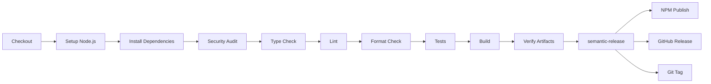

# CI/CD Documentation

This document provides detailed information about the Continuous Integration and Continuous Deployment (CI/CD) pipeline for the Ideogram MCP Server project.

## Overview

The project uses **semantic-release** for fully automated versioning, changelog generation, and publishing to npm and GitHub.

### Workflow Triggers

- **On Push to `main`** - Full release workflow
- **On Pull Request** - Quality checks only (planned)

## Release Workflow

### Pipeline Stages



### Stage Details

#### 1. Checkout (actions/checkout@v4)
- Fetches full git history (`fetch-depth: 0`)
- Required for semantic-release to analyze all commits
- Uses default `persist-credentials: true` (GITHUB_TOKEN)

#### 2. Setup Node.js (actions/setup-node@v4)
- Node.js version: 20 (matches `engines.node`)
- npm cache enabled
- Registry configured for npm publishing

#### 3. Install Dependencies
```bash
npm ci
```
- Clean install from `package-lock.json`
- Faster and more reliable than `npm install`
- Ensures reproducible builds

#### 4. Security Audit
```bash
npm audit --audit-level=high
```
- Scans dependencies for known vulnerabilities
- Fails on high or critical severity vulnerabilities
- Moderate vulnerabilities are logged but don't block releases
- Run `npm audit fix` locally to resolve issues before merging
- Dependabot also monitors all vulnerability levels

#### 5. Type Check
```bash
npm run typecheck
```
- Runs `tsc --noEmit`
- Verifies TypeScript strict mode compliance
- No output files generated

#### 6. Lint
```bash
npm run lint
```
- ESLint with TypeScript parser
- Checks code quality and style
- Run `npm run lint:fix` to auto-fix issues

#### 7. Format Check
```bash
npm run format:check
```
- Prettier formatting validation
- Ensures consistent code style
- Run `npm run format` to auto-format

#### 8. Tests
```bash
npm run test:run
```
- Vitest in single-run mode
- Must pass for deployment
- Coverage targets: 90% statements, 85% branches

#### 9. Build
```bash
npm run build
npm run build:types
```
- **build**: esbuild → `dist/index.js`
- **build:types**: tsc → `dist/index.d.ts`
- Both required for npm package

#### 10. Verify Artifacts
```bash
# Check required files exist
test -f dist/index.js
test -f dist/index.d.ts
```
- Prevents publishing incomplete packages
- Fails early if build issues

#### 11. semantic-release
```bash
npx semantic-release
```
- Analyzes commits since last release
- Determines new version (major/minor/patch)
- Generates CHANGELOG.md
- Creates git tag and GitHub release
- Publishes to npm

## Versioning Strategy

### Conventional Commits

semantic-release analyzes commit messages to determine version bumps:

| Commit Type | Example | Version Bump |
|-------------|---------|--------------|
| `feat:`, `add:` | `feat: add new tool` | **Minor** (1.0.0 → 1.1.0) |
| `fix:` | `fix: resolve timeout` | **Patch** (1.0.0 → 1.0.1) |
| `change:` | `change: update API` | **Minor** (1.0.0 → 1.1.0) |
| `perf:` | `perf: optimize download` | **Patch** (1.0.0 → 1.0.1) |
| `refactor:` | `refactor: simplify logic` | **Patch** (1.0.0 → 1.0.1) |
| `disable:` | `disable: feature flag` | **Patch** (1.0.0 → 1.0.1) |
| `docs:` | `docs: update README` | **No release** |
| `test:` | `test: add unit tests` | **No release** |
| `chore:` | `chore: update deps` | **No release** |
| `remove:` | `remove: deprecated API` | **Major** (1.0.0 → 2.0.0) |
| `BREAKING CHANGE:` | Footer or `!` | **Major** (1.0.0 → 2.0.0) |

### Breaking Changes

Two ways to indicate breaking changes:

**1. Exclamation mark:**
```bash
git commit -m "feat!: redesign API schema"
```

**2. BREAKING CHANGE footer:**
```bash
git commit -m "feat: redesign API schema

BREAKING CHANGE: Input schema has changed from flat to nested structure.
Migration guide: https://..."
```

### No Release Needed

Commits with these types don't trigger releases:
- `test:` - Test updates
- `chore:` - Build/tooling changes
- `ci:` - CI configuration
- `style:` - Code formatting (no logic changes)

## semantic-release Configuration

Configuration file: `.releaserc.json`

### Plugins

1. **@semantic-release/commit-analyzer**
   - Analyzes commits to determine version bump
   - Uses Conventional Commits preset

2. **@semantic-release/release-notes-generator**
   - Generates release notes from commits
   - Categorizes by commit type

3. **@semantic-release/changelog**
   - Updates `CHANGELOG.md`
   - Prepends new version entry
   - Committed back to repository

4. **@semantic-release/npm**
   - Publishes to npm registry with provenance
   - Updates `package.json` version
   - Creates tarball in `release/`

5. **@semantic-release/git**
   - Commits version bump and changelog
   - Message: `chore(release): X.Y.Z [skip ci]`
   - Pushes to `main` branch

6. **@semantic-release/github**
   - Creates GitHub Release
   - Attaches tarball as asset
   - Posts release notes

## Secrets and Environment Variables

### Required Secrets

| Secret | Purpose | Scope |
|--------|---------|-------|
| `NPM_TOKEN` | npm registry authentication | Repository secret |
| `GITHUB_TOKEN` | GitHub API access | Auto-provided by Actions |

### Setting Up NPM_TOKEN

1. **Generate token on npmjs.com:**
   ```text
   https://www.npmjs.com/settings/YOUR_USERNAME/tokens
   → "Generate New Token"
   → Type: "Automation"
   → Copy token (starts with npm_...)
   ```

2. **Add to GitHub:**
   ```text
   Repository Settings
   → Secrets and variables
   → Actions
   → New repository secret
   → Name: NPM_TOKEN
   → Value: [paste token]
   ```

3. **Verify permissions:**
   - Token type: **Automation** or **Publish**
   - Scope: **Read and write**
   - Package: Must have publish access

## Permissions

### GitHub Actions Permissions

```yaml
permissions:
  contents: write      # Commit changelog, create tags, GitHub Release
  id-token: write      # NPM provenance
```

### Why These Permissions?

- **contents: write** - semantic-release commits version bumps, creates tags, and GitHub Releases
- **id-token: write** - Enables npm provenance for supply chain security

## NPM Provenance

Provenance provides cryptographic proof of package origin.

### How It Works

1. GitHub Actions generates OIDC token
2. npm verifies token during publish
3. Provenance attestation stored in registry
4. Users can verify: `npm view @takeshijuan/ideogram-mcp-server --provenance`

### Requirements

- `id-token: write` permission
- `--provenance` flag in publish command
- npm 9.5.0 or later
- Publishing from GitHub Actions

### Benefits

- ✅ Supply chain security
- ✅ Verifiable build process
- ✅ Tamper detection
- ✅ Trust and transparency

## Troubleshooting

### Release Not Triggered

**Symptom:** Merge to main doesn't create release

**Causes:**
1. No releasable commits (only `test:`, `chore:`)
2. Commit messages don't follow conventional format
3. Workflow failed earlier stage

**Solutions:**
```bash
# Check commit messages
git log --oneline origin/main

# Verify conventional format
# ❌ Bad: "updated readme"
# ✅ Good: "docs: update README with examples"

# Check GitHub Actions logs
https://github.com/YOUR_REPO/actions
```

### NPM Publish Failed

**Symptom:** `npm ERR! 401 Unauthorized`

**Causes:**
1. `NPM_TOKEN` not set or expired
2. Token lacks publish permissions
3. Package name conflict

**Solutions:**
```bash
# Verify token is set
# GitHub repo → Settings → Secrets → Actions
# Should see: NPM_TOKEN (set)

# Regenerate token on npmjs.com if needed
# Ensure type is "Automation" with publish scope

# Check package name availability
npm view @takeshijuan/ideogram-mcp-server
```

### Version Conflict

**Symptom:** `The local branch 'main' is behind the remote one`

**Cause:** Another release happened concurrently

**Solution:**
- semantic-release handles this automatically via retry
- If persistent: Check for race conditions in workflow

### Provenance Error

**Symptom:** `npm ERR! Provenance generation failed`

**Causes:**
1. Missing `id-token: write` permission
2. npm version < 9.5.0
3. Not running in GitHub Actions

**Solutions:**
```yaml
# Verify workflow has permission
permissions:
  id-token: write

# Check npm version in CI logs
# Should see: npm@9.5.0 or later

# Ensure using actions/setup-node@v4
```

### Build Artifacts Missing

**Symptom:** `dist/index.js not found`

**Causes:**
1. Build script failed silently
2. Output directory incorrect
3. .gitignore excluding dist/

**Solutions:**
```bash
# Run build locally
npm run build
npm run build:types

# Check output
ls -la dist/
# Should see: index.js, index.d.ts

# Verify package.json scripts
npm run build  # Check command output
```

## Manual Release (Emergency)

If automated release fails and urgent fix needed:

```bash
# 1. Ensure clean state
git checkout main
git pull origin main

# 2. Run quality checks
npm ci
npm run typecheck
npm run lint
npm run test:run
npm run build

# 3. Bump version manually
npm version patch  # or minor, major

# 4. Publish
npm publish --access public --provenance

# 5. Push tag
git push origin main --tags

# 6. Create GitHub Release manually
# https://github.com/YOUR_REPO/releases/new
```

**⚠️ Warning:** Manual releases bypass automated checks. Use only for emergencies.

## Monitoring and Alerts

### Success Indicators

✅ Green checkmark on commit in GitHub
✅ New release on https://github.com/YOUR_REPO/releases
✅ New version on https://www.npmjs.com/package/@takeshijuan/ideogram-mcp-server
✅ Updated CHANGELOG.md in repository

### Failure Alerts

GitHub Actions will send email notifications on failure to:
- Repository owners
- Workflow file author
- Commit author (if different)

Check: GitHub repo → Settings → Notifications

## Best Practices

### For Contributors

1. **Use conventional commits** - Ensures proper versioning
2. **Test locally first** - Run full test suite before PR
3. **One concern per commit** - Easier to review and revert
4. **Write meaningful messages** - Appears in CHANGELOG

### For Maintainers

1. **Review Dependabot PRs** - Keep dependencies updated
2. **Monitor npm audit** - Address vulnerabilities promptly
3. **Rotate secrets periodically** - Update NPM_TOKEN annually
4. **Check release notes** - Ensure generated notes are clear

### For Users

1. **Use specific versions** - Pin to exact version in production
2. **Review changelogs** - Check for breaking changes before upgrade
3. **Report issues** - File GitHub issues for bugs
4. **Verify provenance** - Check package authenticity

## Related Documentation

- [SECURITY.md](./SECURITY.md) - Security guidelines
- [CONTRIBUTING.md](../CONTRIBUTING.md) - Contribution guide
- [README.md](../README.md) - Project overview

## References

- [semantic-release Documentation](https://semantic-release.gitbook.io/)
- [Conventional Commits Specification](https://www.conventionalcommits.org/)
- [npm Provenance](https://docs.npmjs.com/generating-provenance-statements)
- [GitHub Actions Security](https://docs.github.com/en/actions/security-guides)
